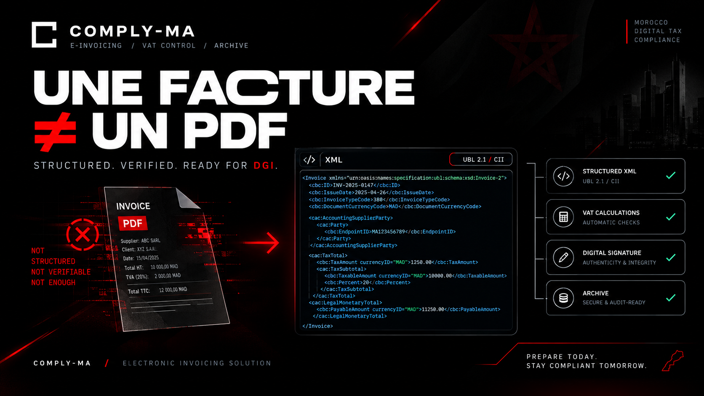

# COMPLY-MA



**Demo video:** [Watch the COMPLY-MA product demo on YouTube](https://youtu.be/qtwNgGZ2LUA)

Moroccan electronic invoicing structuring and archiving software designed for DGI compliance workflows. COMPLY-MA helps businesses prepare, validate, sign, and archive electronic invoices. It is not accounting or tax advice; have a qualified accountant review your compliance requirements.

## Features

- **Invoices and credit notes:** Full lifecycle from draft through validation, delivery, and archiving, controlled by a state machine.
- **Data quality checks:** ICE validation using modulo 97, invoice numbering gap detection, and VAT calculation checks for 0%, 7%, 10%, 14%, and 20% rates.
- **Electronic invoice formats:** UBL 2.1 and CII XML generation, with XML-DSig signing support and PKCS#12 certificates for production.
- **Evidence-based archiving:** Timestamped ZIP archives, SHA-256 hash chains, and configurable retention (10 years by default).
- **Accounting firm workspace:** Manage multiple businesses, each with an isolated SQLite database.
- **Client portal:** Give clients access to their invoices and credit notes online.
- **PDF copies:** Watermarked visual copies; the XML file is the electronic invoice source document.
- **Analytics and reports:** Dashboard, VAT summaries, and a complete audit log.
- **French and Arabic interface:** Includes right-to-left support for Arabic.
- **Purchasing workflows:** Purchase orders, supplier invoice imports, goods receipts, and three-way matching.

## Run locally

Requirements: Python 3.10 or later.

```bash
python -m venv .venv
```

Activate the virtual environment and install development dependencies:

```powershell
# Windows PowerShell
.venv\Scripts\Activate.ps1
python -m pip install -r requirements-dev.txt
Copy-Item .env.example .env
```

```bash
# macOS / Linux
source .venv/bin/activate
python -m pip install -r requirements-dev.txt
cp .env.example .env
```

Start the application:

```bash
python -m uvicorn app.main:app --reload
```

Open [http://localhost:8000](http://localhost:8000). On first run, complete the company setup in the application.

## Investor demo data

To create the prepared investor demo dataset, run:

```bash
python seed_investor_demo.py
```

This script **replaces `comply-ma.db`** and creates demo archives and sample cabinet data. Back up any local database you need before running it.

- Login: `owner`
- Password: `password`

For basic sample data, use `python seed_demo.py`. For a cabinet-only sample, use `python seed_cabinet.py`.

## Tests

```bash
python -m pytest -q
```

## Production deployment

See [DEPLOY.md](DEPLOY.md) for production configuration, deployment, backup and restore, upgrades, and troubleshooting. Docker Compose examples are available in `deploy/`:

```bash
docker compose -f deploy/docker-compose.cabinet.yml up -d --build
```

```bash
docker compose -f deploy/docker-compose.single.yml up -d --build
```

## Security

The application includes CSRF protection for forms, login rate limiting, hardened HTTP security headers and a Content Security Policy, XML parsing protections against XXE, upload type and size validation, and `SameSite=Lax` session cookies. Set `COMPLY_MA_HTTPS_ONLY=true` when serving behind HTTPS. Production startup is blocked when the default secret key is in use.

See `.env.example` and [DEPLOY.md](DEPLOY.md) for configuration details.

## Current limitations

- The DGI clearance API has not yet been published. The `mock` provider simulates clearance and does not transmit invoices to the DGI.
- MOWAKABA eligibility has not been verified. Confirm eligibility with Maroc PME.
